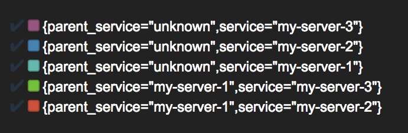
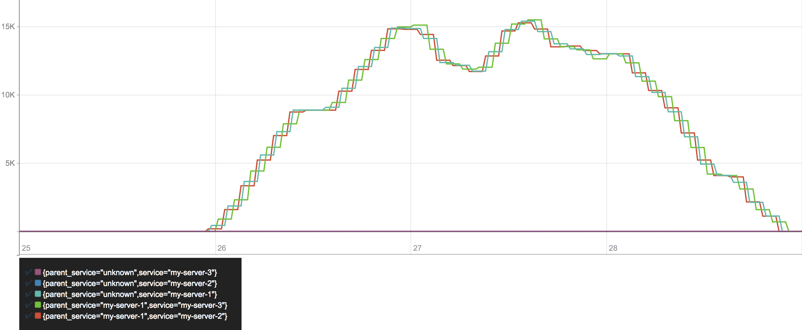
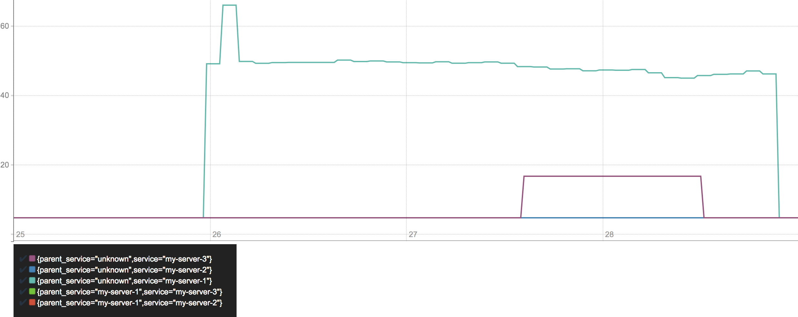
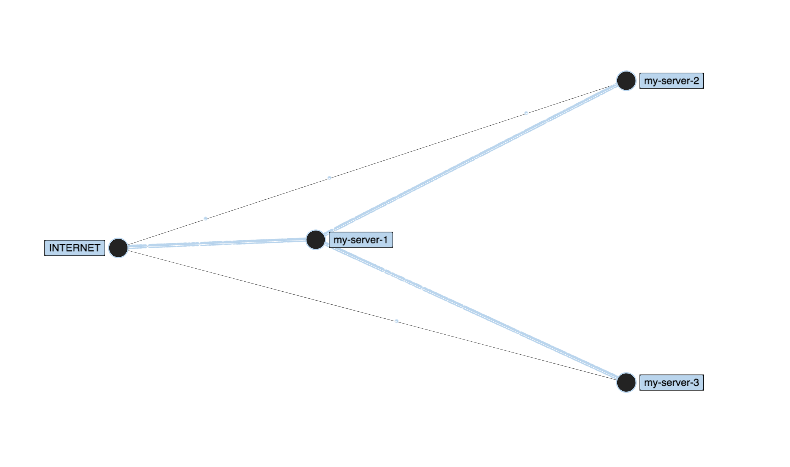

# opentracing-infrastructure-graph

Visualizing infrastructure topology via OpenTracing instrumentation.

## Requirements

- Docker

### Run Prometheus

Modify: `/prometheus-data/prometheus.yml`, replace `192.168.0.10` with your own host machine's IP.  
Host machine IP address: `ifconfig | grep 'inet 192'| awk '{ print $2}'`

```sh
docker run -p 9090:9090 -v "$(pwd)/prometheus-data":/prometheus-data prom/prometheus -config.file=/prometheus-data/prometheus.yml
```

Open Prometheus: [http://http://localhost:9090](http://http://localhost:9090/graph)

## Getting started

It will start three web servers and simulate a service call chain:  
`server1` calls `server2` and `server3` parallel.

```
npm start
curl http://localhost:3001
```

## Metrics between services

`parent_service="unknown"` label means that the request initiator is not instrumented *(Prometheus scraper, curl, etc)*.



### Throughput

Prometheus query:

```
sum(rate(operation_duration_seconds_count{name="http_server"}[1m])) by (service, parent_service)  * 60
```



### 95th response time

Prometheus query:

```
histogram_quantile(0.95, sum(rate(operation_duration_seconds_bucket{name="http_server"}[1m])) by (le, service, parent_service)) * 1000
```



## Infrastructure topology

Data comes from Prometheus.  
Uses [vizceral](https://github.com/Netflix/vizceral).

```
npm run start-client
open http://localhost:8080
```



## Future

- add databases
- show latency
